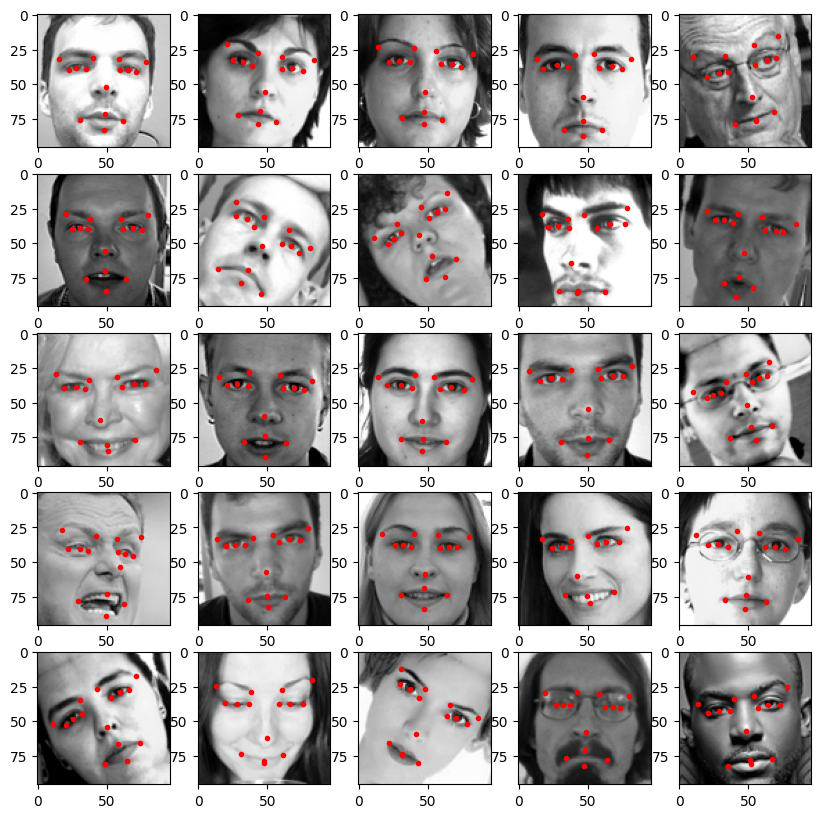
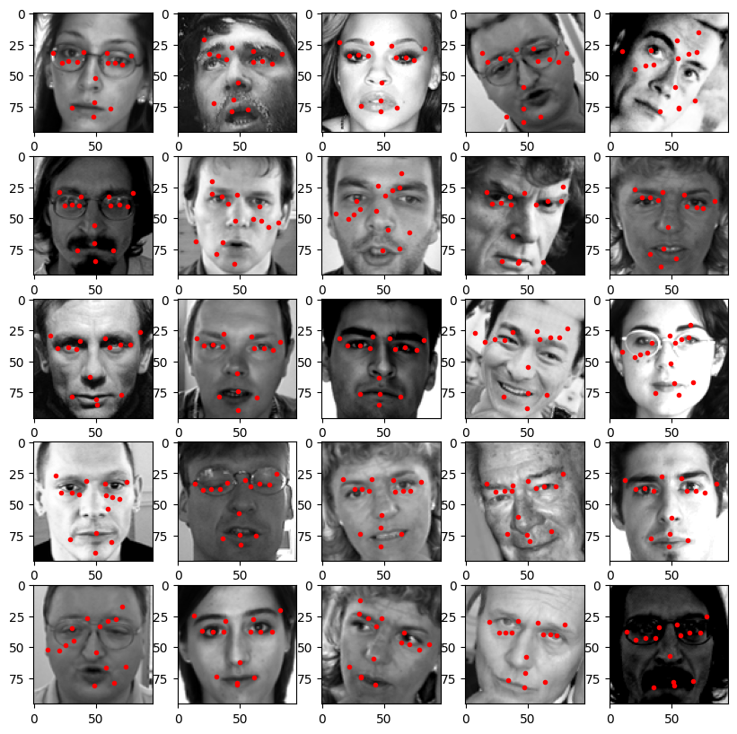

# Face Keypoint Detection

## Data
Below you can see examples of the data that has been the foundation of this project. 
It consists of grayscale images of faces of size (92, 92) with 15 associated keypoints given by (x, y)-positions.

The data can be found on kaggle <https://www.kaggle.com/c/facial-keypoints-detection>

    

## How the model works
The model is a ResNet (Residual Network) that takes the image as an input and outputs 30 values. Pairwise they corrosponds to a keypoint in the input image.

## Install 
In order to run the training the network, you will need to install the requirements from the requirements file.  
Either install locally or create a new python virtual environment. 

Run: **pip install -r requirements.txt**  
Afterwards you can install the local package keypoint_detection by running **pip install -e .**  
This will make sure that the imports of local files will work correctly. 

## Training
In order to train the Model run: **python dcgan/training/train.py**  
The hyperparameters are given in the train.py file. In the future I will make an arg parser or a yaml-file that contains the hyperparameters. 

    

